# Print Gateway Protocol, State Machines, and Sequence Diagrams

## 1. Gateway contract: direction and connection

| Direction | Connection | Message / Operation | Purpose |
|---|---|---|---|
| Gateway → Server | HTTP | `HELLO` | Announce startup/reconnection and identify gateway |
| Server → Gateway | HTTP response | `HELLO_RESPONSE` | Return current lifecycle state/instructions |
| Gateway → Server | WebSocket | `HEARTBEAT` | Confirm gateway is alive and report basic health |
| Server → Gateway | WebSocket | `CAPABILITY_QUERY` | Request current effective print capabilities |
| Gateway → Server | WebSocket | `CAPABILITY_RESPONSE` | Return capabilities derived from local printers |
| Server → Gateway | WebSocket | `PRINT_PREFLIGHT` | Ask whether the gateway can currently fulfill print requirements |
| Gateway → Server | WebSocket | `PRINT_PREFLIGHT_RESPONSE` | Accept/reject requirements and provide reason if rejected |
| Server → Gateway | WebSocket | `PRINT_JOB` | Tell gateway an authorized print job is ready |
| Gateway → Server | WebSocket | `JOB_ACCEPTED` | Gateway accepts responsibility for the job |
| Gateway → Server | WebSocket | `JOB_STATUS` | Report queued/printing/completed/failed state |
| Server → Gateway | WebSocket | `CANCEL_JOB` | Request cancellation where possible |
| Gateway → Server | HTTP | `GET /api/gateway/jobs/{jobId}/artifact` | Download actual print-ready artifact |
| Gateway → Server | HTTP | Configuration/diagnostic requests | Optional maintenance operations |
| Server → Gateway | HTTP | Software/config download | Optional larger payloads such as software updates |

### Connection rules

**HTTP** is used for bootstrap/lifecycle synchronization, reconnection/recovery,
large artifact transfer, and optional maintenance.

**WebSocket** is an outbound connection initiated by the gateway and then used
bidirectionally for operational control/events.

The server should not require an inbound Internet connection to the shop
gateway.

The WebSocket is only a transport mechanism. The persistent server-side job
record is the source of truth, so losing a WebSocket notification must not lose
a print job.

### HELLO

Example request:

```http
POST /api/gateway/hello
Content-Type: application/json
```

```json
{
  "deviceId": "550e8400-e29b-41d4-a716-446655440000",
  "softwareVersion": "0.1.0"
}
```

Possible response before activation:

```json
{
  "state": "PRE_ACTIVATION",
  "retryAfter": 60
}
```

Possible response after activation/operation:

```json
{
  "state": "OPERATIONAL",
  "shopId": "SHOP-1023"
}
```

---

# 2. Four state machines

## 2.1 Customer / browser session

The session represents where the customer is in the interaction. The browser
is generally a projection of server/session state.

```mermaid
stateDiagram-v2
    [*] --> QR_SCANNED

stateDiagram-v2
    [*] --> QR_SCANNED

    QR_SCANNED --> AUTHENTICATING: Submit mobile / request OTP
    
    AUTHENTICATING --> AUTHENTICATED: OTP verified

    AUTHENTICATING --> AUTHENTICATION_FAILED: OTP invalid/expired
    
    AUTHENTICATION_FAILED --> AUTHENTICATING: Retry OTP

    AUTHENTICATING --> SELECTING_DOCUMENTS_CONFIGURING_PRINT:Authentication successfull and pending docs loaded
    
    SELECTING_DOCUMENTS_CONFIGURING_PRINT -->  FAILED:Customer selects Print & pay, print feasibility failed

    SELECTING_DOCUMENTS_CONFIGURING_PRINT --> FINALIZING:Customer selects Print & pay,print feasilbility passed

    FINALIZING --> SELECTING_DOCUMENTS_CONFIGURING_PRINT:Customer decides to edit print job

    FINALIZING --> PAYMENT_PENDING:Customer decides to proceed, selects "pay and print"

    PAYMENT_PENDING --> SELECTING_DOCUMENTS_CONFIGURING_PRINT: Edit print job

    PAYMENT_PENDING --> FAILED: Timeout

    PAYMENT_PENDING --> PRINTING:Payment successful

    PRINTING --> COMPLETED: Job completed
    PRINTING --> PRINT_FAILED: Job failed,refund initiated

    COMPLETED --> [*]
    FAILED --> [*]
    PRINT_FAILED --> [*]
    PAYMENT_FAILED --> [*]
```

---

## 2.2 Print-job state machine

This is the authoritative server-side business/job lifecycle.

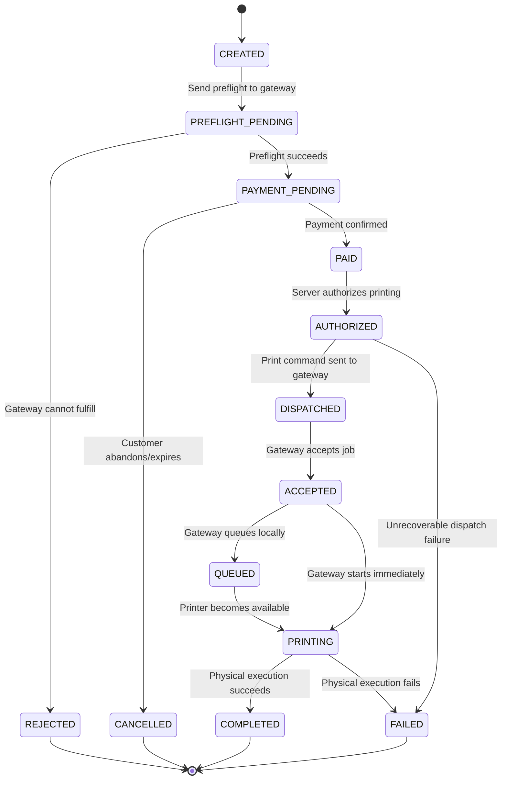
```mermaid
stateDiagram-v2
    [*] --> CREATED

    CREATED --> PREFLIGHT_PENDING: Send preflight to gateway

    PREFLIGHT_PENDING --> REJECTED: Gateway cannot fulfill
    PREFLIGHT_PENDING --> PAYMENT_PENDING: Preflight succeeds

    PAYMENT_PENDING --> CANCELLED: Customer abandons/expires
    PAYMENT_PENDING --> PAID: Payment confirmed

    PAID --> AUTHORIZED: Server authorizes printing

    AUTHORIZED --> DISPATCHED: Print command sent to gateway
    DISPATCHED --> ACCEPTED: Gateway accepts job

    ACCEPTED --> QUEUED: Gateway queues locally
    ACCEPTED --> PRINTING: Gateway starts immediately

    QUEUED --> PRINTING: Printer becomes available

    PRINTING --> COMPLETED: Physical execution succeeds
    PRINTING --> FAILED: Physical execution fails

    AUTHORIZED --> FAILED: Unrecoverable dispatch failure

    COMPLETED --> [*]
    FAILED --> [*]
    REJECTED --> [*]
    CANCELLED --> [*]
```

Important distinctions:

- `PAID` means payment is confirmed.
- `AUTHORIZED` means the server has authorized physical execution.
- `ACCEPTED` means the gateway has accepted responsibility.
- `QUEUED` means the gateway is holding the job locally.
- `PRINTING` means physical printing has started.
- `COMPLETED` means the gateway has reported successful execution.

---

## 2.3 Gateway lifecycle state machine

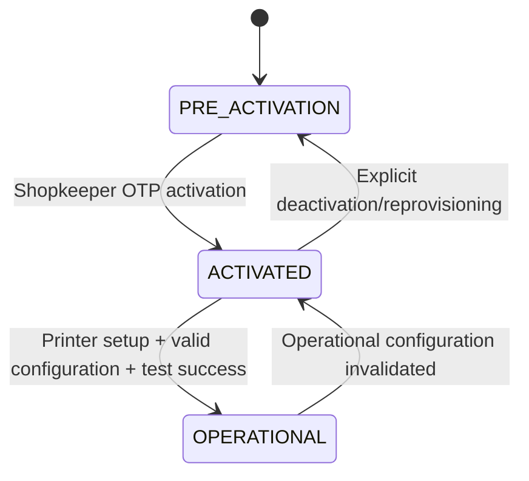
```mermaid
stateDiagram-v2
    [*] --> PRE_ACTIVATION

    PRE_ACTIVATION --> ACTIVATED: Shopkeeper OTP activation

    ACTIVATED --> OPERATIONAL: Printer setup + valid configuration + test success

    OPERATIONAL --> ACTIVATED: Operational configuration invalidated
    ACTIVATED --> PRE_ACTIVATION: Explicit deactivation/reprovisioning
```

Connectivity should be treated separately:

```text
Gateway lifecycle = OPERATIONAL
Connectivity       = CONNECTED / DISCONNECTED
```

Thus a gateway can remain logically `OPERATIONAL` while temporarily disconnected.

---

## 2.4 Individual printer state machine

Each printer attached to the gateway is an independent state machine.

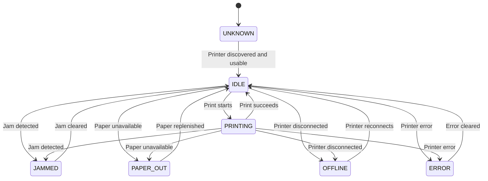
```mermaid
stateDiagram-v2
    [*] --> UNKNOWN

    UNKNOWN --> IDLE: Printer discovered and usable

    IDLE --> PRINTING: Print starts
    PRINTING --> IDLE: Print succeeds

    IDLE --> JAMMED: Jam detected
    PRINTING --> JAMMED: Jam detected

    IDLE --> PAPER_OUT: Paper unavailable
    PRINTING --> PAPER_OUT: Paper unavailable

    IDLE --> OFFLINE: Printer disconnected
    PRINTING --> OFFLINE: Printer disconnected

    IDLE --> ERROR: Printer error
    PRINTING --> ERROR: Printer error

    JAMMED --> IDLE: Jam cleared
    PAPER_OUT --> IDLE: Paper replenished
    ERROR --> IDLE: Error cleared
    OFFLINE --> IDLE: Printer reconnects
```

For multiple printers:

```text
Gateway
└── OPERATIONAL
     ├── Printer A state machine
     │     └── PRINTING
     │
     └── Printer B state machine
           └── IDLE
```

---

## 2.5 Browser user session state machine

Represents customer UI flow in browser. Single SM with mode branching for anonymous vs OTP-authenticated scan-initiated sessions. Mode flag determines entry path.

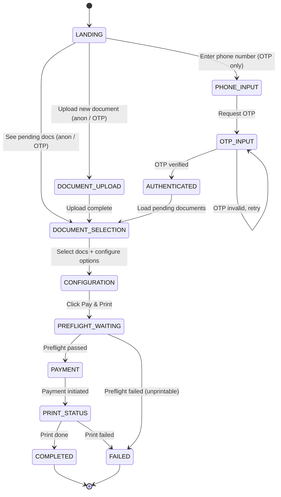
```mermaid
stateDiagram-v2
    [*] --> LANDING

    LANDING --> DOCUMENT_SELECTION: See pending docs (anon / OTP)
    LANDING --> DOCUMENT_UPLOAD: Upload new document (anon / OTP)
    LANDING --> PHONE_INPUT: Enter phone number (OTP only)

    DOCUMENT_UPLOAD --> DOCUMENT_SELECTION: Upload complete

    PHONE_INPUT --> OTP_INPUT: Request OTP
    OTP_INPUT --> AUTHENTICATED: OTP verified
    OTP_INPUT --> OTP_INPUT: OTP invalid, retry

    AUTHENTICATED --> DOCUMENT_SELECTION: Load pending documents

    DOCUMENT_SELECTION --> CONFIGURATION: Select docs + configure options

    CONFIGURATION --> PREFLIGHT_WAITING: Click Pay & Print

    PREFLIGHT_WAITING --> PAYMENT: Preflight passed
    PREFLIGHT_WAITING --> FAILED: Preflight failed (unprintable)

    PAYMENT --> PRINT_STATUS: Payment initiated

    PRINT_STATUS --> COMPLETED: Print done
    PRINT_STATUS --> FAILED: Print failed

    COMPLETED --> [*]
    FAILED --> [*]
```

### Events (browser emits, consumed by server SM)

| Event | User action | Description |
|---|---|---|
| `page_loaded` | Scan QR | Shop landing page opened |
| `phone_submitted` | Enter phone | Customer entered phone number |
| `otp_submitted` | Enter OTP | Customer submitted OTP code |
| `documents_selected` | Select docs | Customer chose documents to print |
| `document_uploaded` | Upload file | Customer uploaded new document |
| `options_configured` | Configure | Customer set copies, color, duplex |
| `pay_clicked` | Click Pay & Print | Customer initiated payment |
| `payment_done` | Complete payment | Customer completed UPI payment |

---

## 2.6 Server-side user session state machine

Authoritative business-logic SM for scan-initiated sessions. Single SM with mode branching. Mode flag = `ANONYMOUS` or `OTP_AUTHENTICATED`. Events are validated signals from browser session, not raw UI actions.

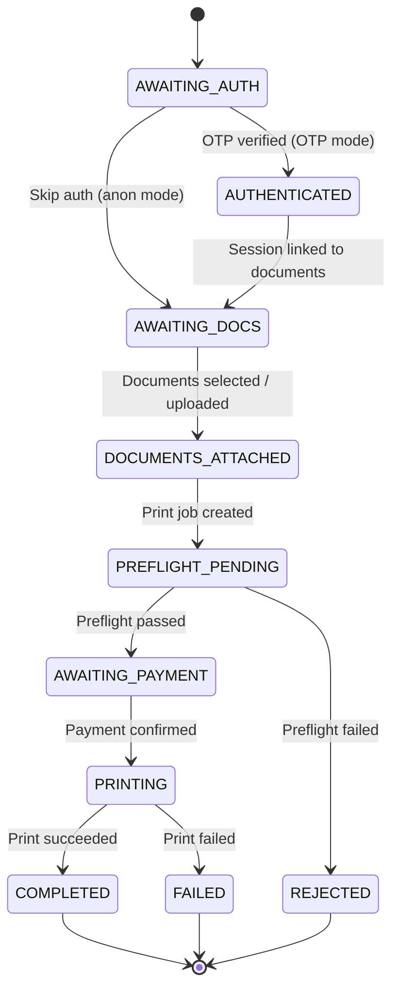
```mermaid
stateDiagram-v2
    [*] --> AWAITING_AUTH

    AWAITING_AUTH --> AUTHENTICATED: OTP verified (OTP mode)
    AWAITING_AUTH --> AWAITING_DOCS: Skip auth (anon mode)

    AUTHENTICATED --> AWAITING_DOCS: Session linked to documents

    AWAITING_DOCS --> DOCUMENTS_ATTACHED: Documents selected / uploaded

    DOCUMENTS_ATTACHED --> PREFLIGHT_PENDING: Print job created

    PREFLIGHT_PENDING --> AWAITING_PAYMENT: Preflight passed
    PREFLIGHT_PENDING --> REJECTED: Preflight failed

    AWAITING_PAYMENT --> PRINTING: Payment confirmed

    PRINTING --> COMPLETED: Print succeeded
    PRINTING --> FAILED: Print failed

    COMPLETED --> [*]
    FAILED --> [*]
    REJECTED --> [*]
```

### Events (server receives, not browser)

| Event | Source | Description |
|---|---|---|
| `session_created` | Browser scan | Customer scanned shop QR |
| `otp_requested` | Browser | Customer submitted phone |
| `otp_verified` | Server OTP check | OTP matched, not expired |
| `otp_failed` | Server OTP check | OTP invalid or expired |
| `documents_attached` | Browser | Customer selected/uploaded docs |
| `job_created` | Server | Print job record created |
| `preflight_passed` | Gateway | Gateway confirmed feasibility |
| `preflight_failed` | Gateway | Gateway rejected requirements |
| `payment_confirmed` | Payment webhook | Payment provider confirmed |
| `payment_failed` | Payment webhook | Payment declined/error |
| `print_done` | Gateway | Physical print completed |
| `print_failed` | Gateway | Physical print failed |

---

# 3. Sequence diagrams with state transitions

State annotations use notes next to arrows to show the important transition at
the head/tail of the interaction.

## 3.1 Happy path — everything succeeds

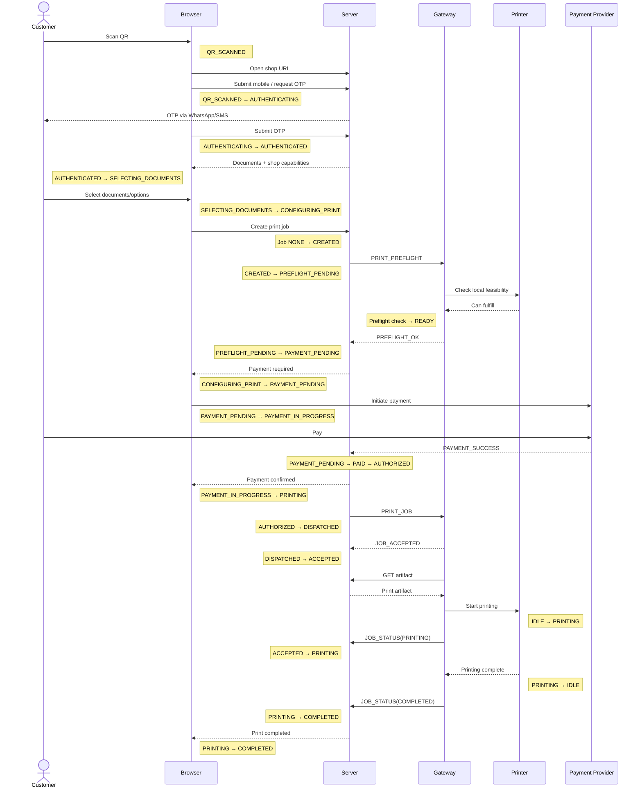
```mermaid
sequenceDiagram
    actor C as Customer
    participant B as Browser
    participant S as Server
    participant G as Gateway
    participant P as Printer
    participant Pay as Payment Provider

    C->>B: Scan QR
    Note right of B: QR_SCANNED

    B->>S: Open shop URL

    B->>S: Submit mobile / request OTP
    Note right of B: QR_SCANNED → AUTHENTICATING

    S-->>C: OTP via WhatsApp/SMS

    B->>S: Submit OTP
    Note right of B: AUTHENTICATING → AUTHENTICATED

    S-->>B: Documents + shop capabilities
    Note left of B: AUTHENTICATED → SELECTING_DOCUMENTS

    C->>B: Select documents/options
    Note right of B: SELECTING_DOCUMENTS → CONFIGURING_PRINT

    B->>S: Create print job
    Note left of S: Job NONE → CREATED

    S->>G: PRINT_PREFLIGHT
    Note left of S: CREATED → PREFLIGHT_PENDING

    G->>P: Check local feasibility

    P-->>G: Can fulfill
    Note left of G: Preflight check → READY

    G-->>S: PREFLIGHT_OK
    Note left of S: PREFLIGHT_PENDING → PAYMENT_PENDING

    S-->>B: Payment required
    Note right of B: CONFIGURING_PRINT → PAYMENT_PENDING

    B->>Pay: Initiate payment
    Note right of B: PAYMENT_PENDING → PAYMENT_IN_PROGRESS

    C->>Pay: Pay
    Pay-->>S: PAYMENT_SUCCESS

    Note over S: PAYMENT_PENDING → PAID → AUTHORIZED

    S-->>B: Payment confirmed
    Note right of B: PAYMENT_IN_PROGRESS → PRINTING

    S->>G: PRINT_JOB
    Note left of S: AUTHORIZED → DISPATCHED

    G-->>S: JOB_ACCEPTED
    Note left of S: DISPATCHED → ACCEPTED

    G->>S: GET artifact
    S-->>G: Print artifact

    G->>P: Start printing
    Note right of P: IDLE → PRINTING

    G->>S: JOB_STATUS(PRINTING)
    Note left of S: ACCEPTED → PRINTING

    P-->>G: Printing complete
    Note right of P: PRINTING → IDLE

    G->>S: JOB_STATUS(COMPLETED)
    Note left of S: PRINTING → COMPLETED

    S-->>B: Print completed
    Note right of B: PRINTING → COMPLETED
```

---

## 3.2 OTP authentication failure

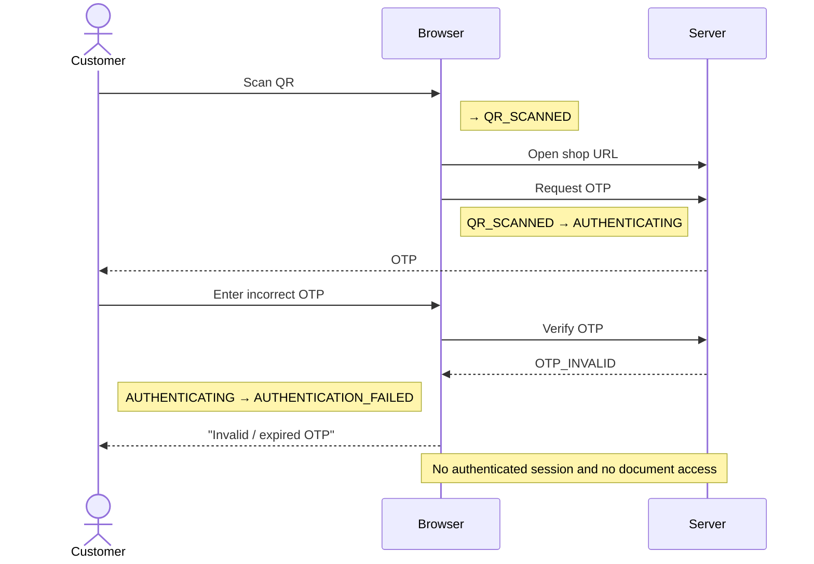
```mermaid
sequenceDiagram
    actor C as Customer
    participant B as Browser
    participant S as Server

    C->>B: Scan QR
    Note right of B: → QR_SCANNED

    B->>S: Open shop URL

    B->>S: Request OTP
    Note right of B: QR_SCANNED → AUTHENTICATING

    S-->>C: OTP

    C->>B: Enter incorrect OTP
    B->>S: Verify OTP

    S-->>B: OTP_INVALID
    Note left of B: AUTHENTICATING → AUTHENTICATION_FAILED

    B-->>C: "Invalid / expired OTP"

    Note over S,B: No authenticated session and no document access
```

---

## 3.3 Preflight failure — printer cannot fulfill the job

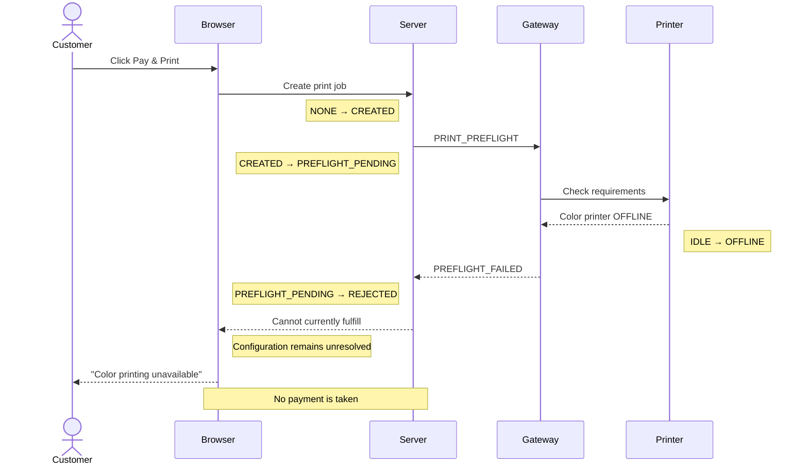
```mermaid
sequenceDiagram
    actor C as Customer
    participant B as Browser
    participant S as Server
    participant G as Gateway
    participant P as Printer

    C->>B: Click Pay & Print
    B->>S: Create print job
    Note left of S: NONE → CREATED

    S->>G: PRINT_PREFLIGHT
    Note left of S: CREATED → PREFLIGHT_PENDING

    G->>P: Check requirements
    P-->>G: Color printer OFFLINE
    Note right of P: IDLE → OFFLINE

    G-->>S: PREFLIGHT_FAILED
    Note left of S: PREFLIGHT_PENDING → REJECTED

    S-->>B: Cannot currently fulfill
    Note right of B: Configuration remains unresolved

    B-->>C: "Color printing unavailable"

    Note over S,B: No payment is taken
```

---

## 3.4 Preflight failure — insufficient paper

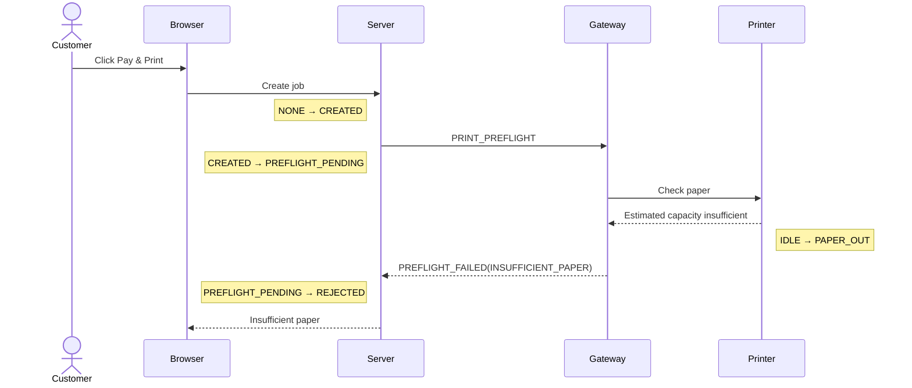
```mermaid
sequenceDiagram
    actor C as Customer
    participant B as Browser
    participant S as Server
    participant G as Gateway
    participant P as Printer

    C->>B: Click Pay & Print
    B->>S: Create job
    Note left of S: NONE → CREATED

    S->>G: PRINT_PREFLIGHT
    Note left of S: CREATED → PREFLIGHT_PENDING

    G->>P: Check paper
    P-->>G: Estimated capacity insufficient
    Note right of P: IDLE → PAPER_OUT

    G-->>S: PREFLIGHT_FAILED(INSUFFICIENT_PAPER)
    Note left of S: PREFLIGHT_PENDING → REJECTED

    S-->>B: Insufficient paper
```

Preflight should be treated as a current feasibility check, not an absolute
guarantee about future physical output.

---

## 3.5 Payment failure

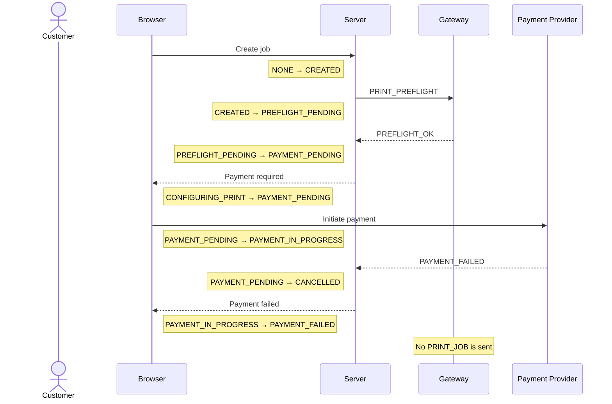
```mermaid
sequenceDiagram
    actor C as Customer
    participant B as Browser
    participant S as Server
    participant G as Gateway
    participant Pay as Payment Provider

    B->>S: Create job
    Note left of S: NONE → CREATED

    S->>G: PRINT_PREFLIGHT
    Note left of S: CREATED → PREFLIGHT_PENDING

    G-->>S: PREFLIGHT_OK
    Note left of S: PREFLIGHT_PENDING → PAYMENT_PENDING

    S-->>B: Payment required
    Note right of B: CONFIGURING_PRINT → PAYMENT_PENDING

    B->>Pay: Initiate payment
    Note right of B: PAYMENT_PENDING → PAYMENT_IN_PROGRESS

    Pay-->>S: PAYMENT_FAILED

    Note left of S: PAYMENT_PENDING → CANCELLED

    S-->>B: Payment failed
    Note right of B: PAYMENT_IN_PROGRESS → PAYMENT_FAILED

    Note over G: No PRINT_JOB is sent
```

---

## 3.6 Payment succeeds, gateway disappears

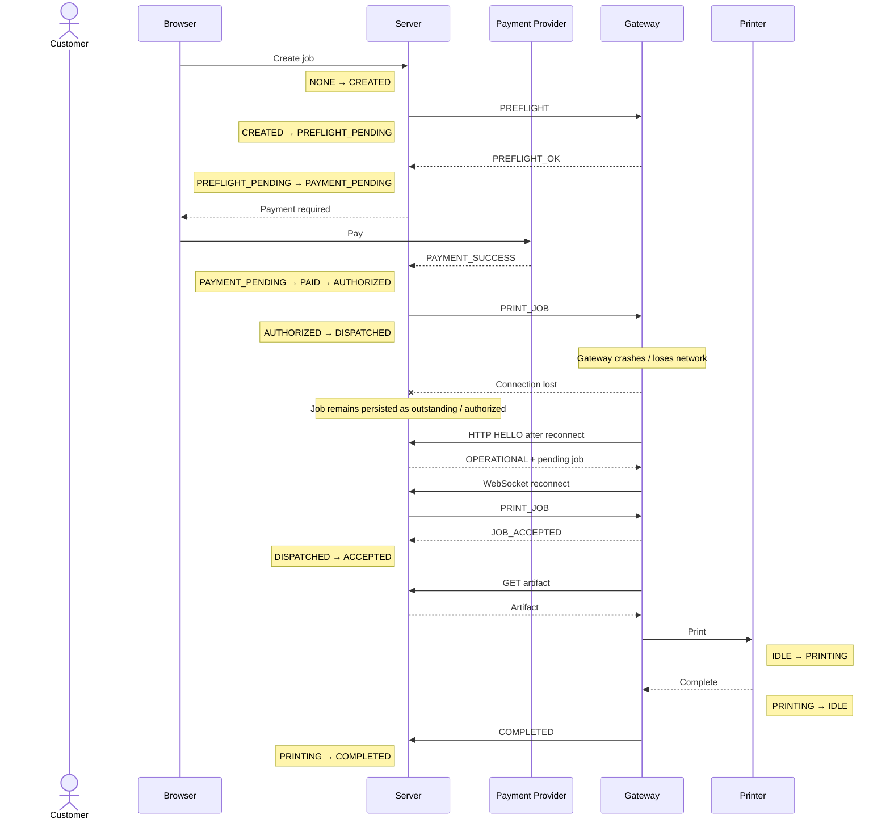
```mermaid
sequenceDiagram
    actor C as Customer
    participant B as Browser
    participant S as Server
    participant Pay as Payment Provider
    participant G as Gateway
    participant P as Printer

    B->>S: Create job
    Note left of S: NONE → CREATED

    S->>G: PREFLIGHT
    Note left of S: CREATED → PREFLIGHT_PENDING

    G-->>S: PREFLIGHT_OK
    Note left of S: PREFLIGHT_PENDING → PAYMENT_PENDING

    S-->>B: Payment required
    B->>Pay: Pay
    Pay-->>S: PAYMENT_SUCCESS

    Note left of S: PAYMENT_PENDING → PAID → AUTHORIZED

    S->>G: PRINT_JOB
    Note left of S: AUTHORIZED → DISPATCHED

    Note over G: Gateway crashes / loses network
    G--xS: Connection lost

    Note over S: Job remains persisted as outstanding / authorized

    G->>S: HTTP HELLO after reconnect
    S-->>G: OPERATIONAL + pending job

    G->>S: WebSocket reconnect

    S->>G: PRINT_JOB
    G-->>S: JOB_ACCEPTED
    Note left of S: DISPATCHED → ACCEPTED

    G->>S: GET artifact
    S-->>G: Artifact

    G->>P: Print
    Note right of P: IDLE → PRINTING

    P-->>G: Complete
    Note right of P: PRINTING → IDLE

    G->>S: COMPLETED
    Note left of S: PRINTING → COMPLETED
```

The lost WebSocket notification does not imply a lost job because the job is
persisted independently.

---

## 3.7 Runtime printer failure after successful preflight

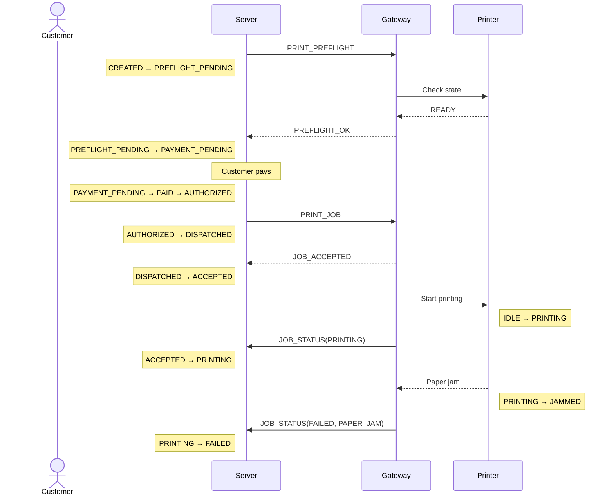
```mermaid
sequenceDiagram
    actor C as Customer
    participant S as Server
    participant G as Gateway
    participant P as Printer

    S->>G: PRINT_PREFLIGHT
    Note left of S: CREATED → PREFLIGHT_PENDING

    G->>P: Check state
    P-->>G: READY

    G-->>S: PREFLIGHT_OK
    Note left of S: PREFLIGHT_PENDING → PAYMENT_PENDING

    Note over S: Customer pays
    Note left of S: PAYMENT_PENDING → PAID → AUTHORIZED

    S->>G: PRINT_JOB
    Note left of S: AUTHORIZED → DISPATCHED

    G-->>S: JOB_ACCEPTED
    Note left of S: DISPATCHED → ACCEPTED

    G->>P: Start printing
    Note right of P: IDLE → PRINTING

    G->>S: JOB_STATUS(PRINTING)
    Note left of S: ACCEPTED → PRINTING

    P-->>G: Paper jam
    Note right of P: PRINTING → JAMMED

    G->>S: JOB_STATUS(FAILED, PAPER_JAM)
    Note left of S: PRINTING → FAILED
```

The server decides the financial consequence: retry, refund, partial refund or
manual resolution.

---

## 3.8 Two printers — mixed B&W + color job

The server sends print requirements. The gateway chooses the actual printers.

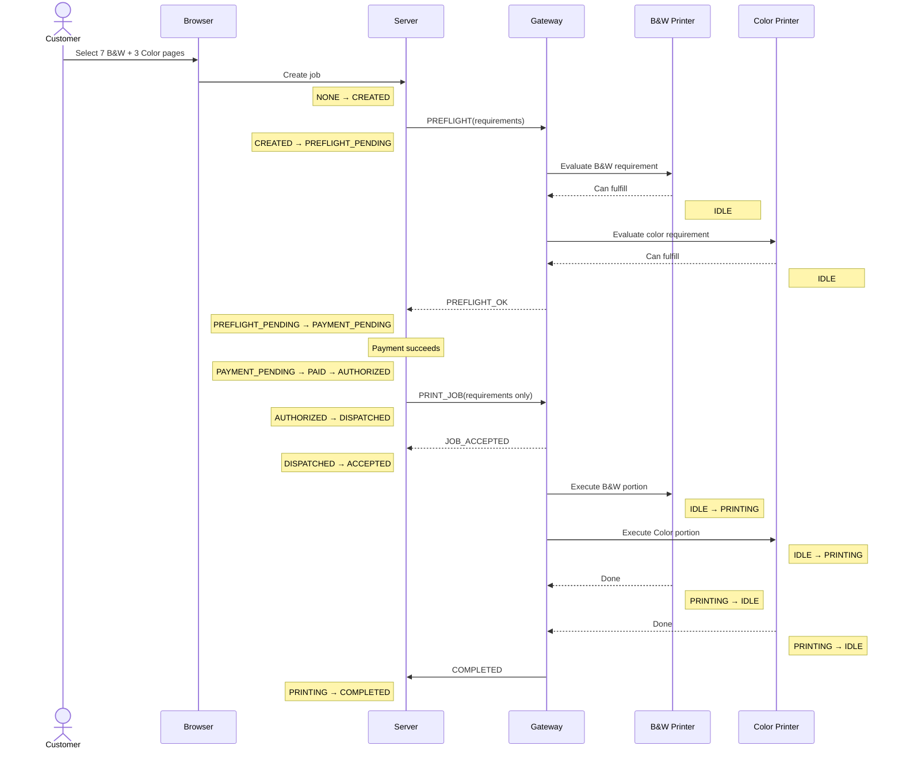
```mermaid
sequenceDiagram
    actor C as Customer
    participant B as Browser
    participant S as Server
    participant G as Gateway
    participant BW as B&W Printer
    participant COL as Color Printer

    C->>B: Select 7 B&W + 3 Color pages

    B->>S: Create job
    Note left of S: NONE → CREATED

    S->>G: PREFLIGHT(requirements)
    Note left of S: CREATED → PREFLIGHT_PENDING

    G->>BW: Evaluate B&W requirement
    BW-->>G: Can fulfill
    Note right of BW: IDLE

    G->>COL: Evaluate color requirement
    COL-->>G: Can fulfill
    Note right of COL: IDLE

    G-->>S: PREFLIGHT_OK
    Note left of S: PREFLIGHT_PENDING → PAYMENT_PENDING

    Note over S: Payment succeeds
    Note left of S: PAYMENT_PENDING → PAID → AUTHORIZED

    S->>G: PRINT_JOB(requirements only)
    Note left of S: AUTHORIZED → DISPATCHED

    G-->>S: JOB_ACCEPTED
    Note left of S: DISPATCHED → ACCEPTED

    G->>BW: Execute B&W portion
    Note right of BW: IDLE → PRINTING

    G->>COL: Execute Color portion
    Note right of COL: IDLE → PRINTING

    BW-->>G: Done
    Note right of BW: PRINTING → IDLE

    COL-->>G: Done
    Note right of COL: PRINTING → IDLE

    G->>S: COMPLETED
    Note left of S: PRINTING → COMPLETED
```

The server never needs to know the individual printer IDs.

---

## 3.9 Gateway busy — job queued locally

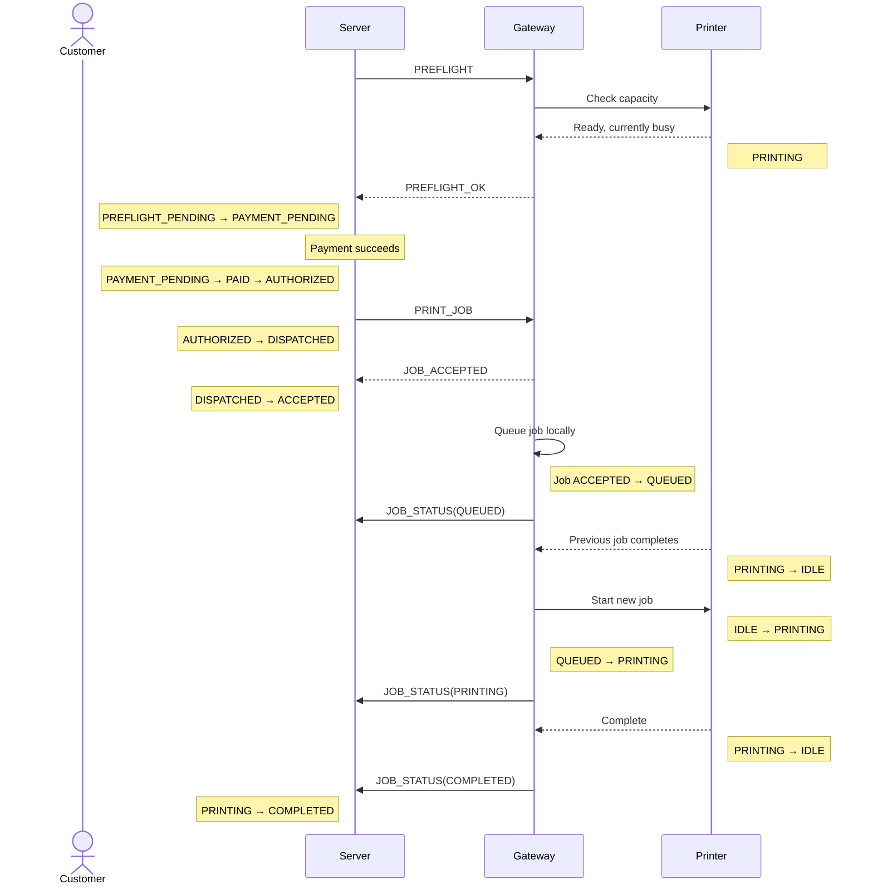
```mermaid
sequenceDiagram
    actor C as Customer
    participant S as Server
    participant G as Gateway
    participant P as Printer

    S->>G: PREFLIGHT
    G->>P: Check capacity
    P-->>G: Ready, currently busy
    Note right of P: PRINTING

    G-->>S: PREFLIGHT_OK
    Note left of S: PREFLIGHT_PENDING → PAYMENT_PENDING

    Note over S: Payment succeeds
    Note left of S: PAYMENT_PENDING → PAID → AUTHORIZED

    S->>G: PRINT_JOB
    Note left of S: AUTHORIZED → DISPATCHED

    G-->>S: JOB_ACCEPTED
    Note left of S: DISPATCHED → ACCEPTED

    G->>G: Queue job locally
    Note right of G: Job ACCEPTED → QUEUED

    G->>S: JOB_STATUS(QUEUED)

    P-->>G: Previous job completes
    Note right of P: PRINTING → IDLE

    G->>P: Start new job
    Note right of P: IDLE → PRINTING
    Note right of G: QUEUED → PRINTING

    G->>S: JOB_STATUS(PRINTING)

    P-->>G: Complete
    Note right of P: PRINTING → IDLE

    G->>S: JOB_STATUS(COMPLETED)
    Note left of S: PRINTING → COMPLETED
```

---

## 3.10 Browser disappears after payment

The browser does not own the printing transaction after authorization.

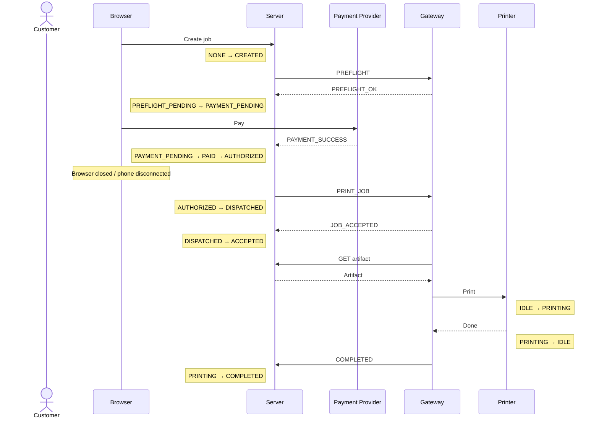
```mermaid
sequenceDiagram
    actor C as Customer
    participant B as Browser
    participant S as Server
    participant Pay as Payment Provider
    participant G as Gateway
    participant P as Printer

    B->>S: Create job
    Note left of S: NONE → CREATED

    S->>G: PREFLIGHT
    G-->>S: PREFLIGHT_OK
    Note left of S: PREFLIGHT_PENDING → PAYMENT_PENDING

    B->>Pay: Pay
    Pay-->>S: PAYMENT_SUCCESS

    Note left of S: PAYMENT_PENDING → PAID → AUTHORIZED

    Note over B: Browser closed / phone disconnected

    S->>G: PRINT_JOB
    Note left of S: AUTHORIZED → DISPATCHED

    G-->>S: JOB_ACCEPTED
    Note left of S: DISPATCHED → ACCEPTED

    G->>S: GET artifact
    S-->>G: Artifact

    G->>P: Print
    Note right of P: IDLE → PRINTING

    P-->>G: Done
    Note right of P: PRINTING → IDLE

    G->>S: COMPLETED
    Note left of S: PRINTING → COMPLETED
```

---

## 3.11 Gateway reconnects after being offline

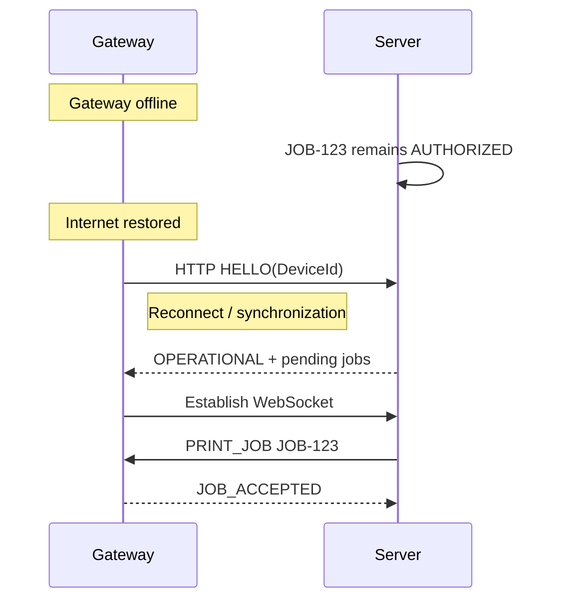
```mermaid
sequenceDiagram
    participant G as Gateway
    participant S as Server

    Note over G: Gateway offline

    S->>S: JOB-123 remains AUTHORIZED

    Note over G: Internet restored

    G->>S: HTTP HELLO(DeviceId)
    Note right of G: Reconnect / synchronization

    S-->>G: OPERATIONAL + pending jobs

    G->>S: Establish WebSocket

    S->>G: PRINT_JOB JOB-123
    G-->>S: JOB_ACCEPTED
```

---

# 4. State-machine ownership

The six machines represent six different realities:

```text
┌──────────────────────────────────────────────┐
│                  WEB SERVER                  │
│                                              │
│   Browser Session State Machine              │
│     (projected to browser,                   │
│      events from user actions)               │
│                                              │
│   Server Session State Machine               │
│     (authoritative,                          │
│      events from validated signals)          │
│                                              │
│   Print Job State Machine                    │
│     (authoritative execution lifecycle)      │
│                                              │
└────────────────┬─────────────────────────────┘
                 │
            HTTP/WebSocket
                 │
                 ▼
┌──────────────────────────────────────────────┐
│                   GATEWAY                   │
│                                              │
│   Gateway Lifecycle State Machine            │
│                                              │
│      ┌──────────┼──────────┐                │
│      ▼          ▼          ▼                │
│   Printer A  Printer B  Printer C            │
│   State SM   State SM   State SM             │
│                                              │
└──────────────────────────────────────────────┘
```

### Authoritative ownership

| Fact | Authoritative component |
|---|---|
| Customer authentication/session | Server/session layer |
| Customer print requirements | Server after validation |
| Payment | Server/payment system |
| Print-job lifecycle | Server |
| Gateway lifecycle | Gateway + server registration state |
| Gateway local connectivity | Gateway; server observes it |
| Printer topology | Gateway |
| Printer physical state | Gateway |
| Local printer selection/routing | Gateway |
| Physical execution result | Gateway, reported to server |
| Refund/business consequence | Server |

## Core principle

> **A component should be authoritative only over facts it can actually know.**

Examples:

```text
Payment succeeded
    → Server knows.

Printer jammed
    → Gateway knows.

Customer wants Color/A4/Duplex
    → Server receives and validates.

Which physical printer should handle that request
    → Gateway decides.

Physical printing completed
    → Gateway reports it.

Whether a refund is owed
    → Server decides.
```

# 5. Overall architecture

```text
Customer
   │
   │ QR + OTP
   ▼
Browser / Session
   │
   │ print requirements
   ▼
Server
   │
   │ preflight
   ▼
Gateway
   │
   │ local capability + printer state
   ▼
Server
   │
   │ payment
   ▼
Server
   │
   │ authorized print job
   ▼
Gateway
   │
   │ local scheduling/routing
   ▼
Printer(s)
   │
   │ physical result
   ▼
Gateway
   │
   │ status
   ▼
Server
   │
   ▼
Customer / transaction completion
```

The central architectural boundary is:

> **The server specifies WHAT should be printed. The gateway decides HOW the
> shop's physical printers will fulfill it.**
